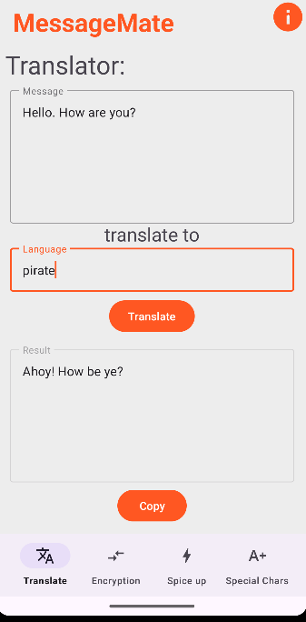
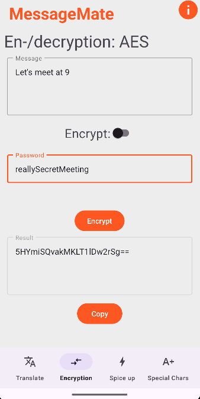
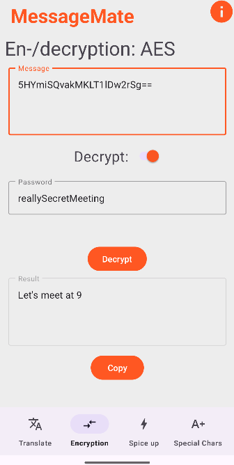
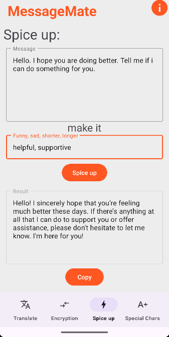
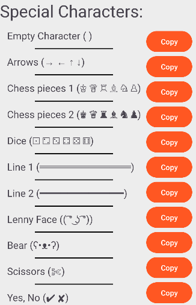

# MessageMate

---
###### An Android app that helps you compose your message

---

## Demo video:
* pass (**TODO**)

## Features:
* Information page
* Bottom bar with 4 buttons for 4 different pages:
* ### Translate:
  * Enter the message you want to translate
  * Enter your target language
  * Press 'Translate'
  * You can copy the result
  
  

* ### Encryption:
  * Choose between Caeser and AES
  * Enter the message you want to encrypt / decrypt
  * Select whether you want to encrypt or decrypt
  * Enter a shift (Caeser) or a password (AES)
  * Click the button
  * You can copy the result
  
  
  

* ### Spice up:
  * Enter the message you want to modify
  * Also enter a few keywords, like funny, sad, poetic etc.
  * Press the button
  * Copy the result if you want
  
  

* ### Special Characters:
  * A list of many useful and special characters
  * For example the empty character or chess pieces, arrows, lines, ...
  * Easy to copy and paste into your chat
  
  
  

## How to use:
* Get the app here
* Or clone the repo and compile it on your own. You need your own OpenAI API-Key.

## Credits:
* Code: Qwatrum
* Design: Qwatrum
* Icons: Android Studio (Apache License Version 2.0)
* Translation & modifying powered by GPT-4o-mini

made with <3 by Qwatrum